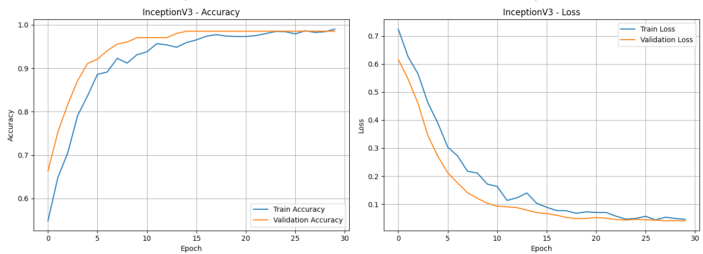
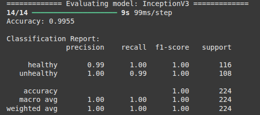
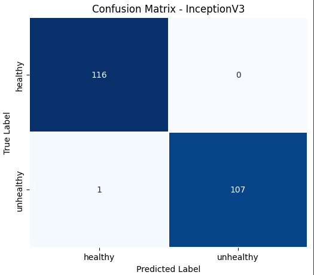
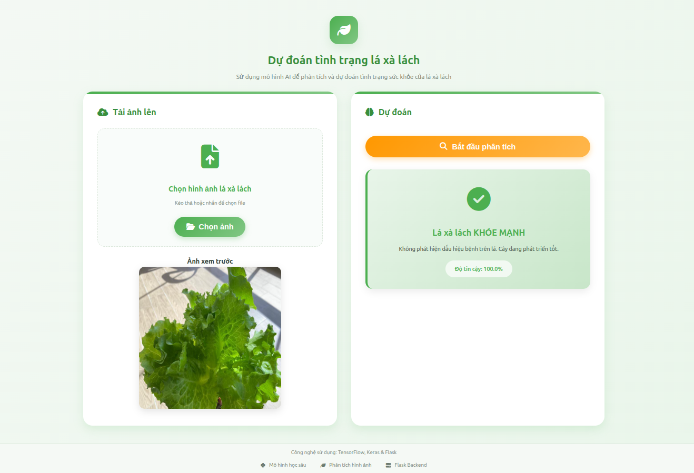
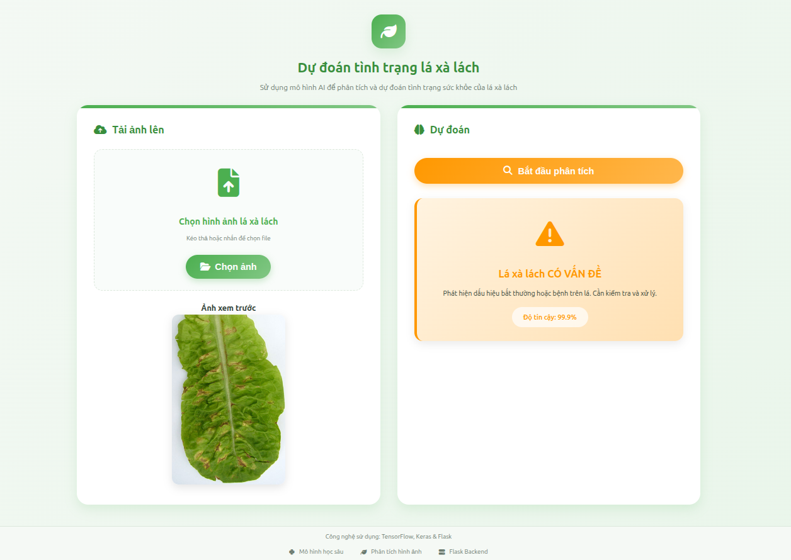

# 🥬 Lettuce Health Classification (InceptionV3)

## 📘 Giới thiệu  
Dự án này nhằm **phân loại tình trạng sức khỏe của cây xà lách (Healthy / Unhealthy)** bằng mô hình **InceptionV3** được huấn luyện sẵn.  
Mục tiêu của dự án là **tự động nhận dạng cây khỏe mạnh và cây bị bệnh** nhằm hỗ trợ nông nghiệp thông minh.

---

## 📂 Cấu trúc dự án  

```
lettuce_classification/
├── data/                    # Thư mục chứa dữ liệu (không đính kèm)
├── notebooks/               # Notebook huấn luyện & đánh giá
├── outputs/                 # Lưu mô hình và kết quả
├── src/                     # Mã nguồn chính
├── web
├── requirements.txt         # Thư viện cần cài đặt
└── README.md
```

---

## 📦 Cài đặt môi trường

Yêu cầu **Python ≥ 3.10**

```bash
git clone https://github.com/HuySang-04/lettuce_classification.git
cd lettuce_classification
pip install -r requirements.txt
```

---

## 🧠 Dữ liệu & Mô hình huấn luyện sẵn  

- **Dataset:** [📦 Google Drive Link](https://drive.google.com/file/d/1fi3XCPPw97dPGbIqAe7VRXyzW4D6kWC2/view?usp=drive_link)  
- **Pretrained Model:** [🧠 Google Drive Link](https://drive.google.com/file/d/1n9NJtc2pmE5mDkpAT5qgtN6-adKEblrr/view?usp=drive_link)

> Sau khi tải, đặt file dữ liệu vào thư mục `data/` và mô hình vào `outputs/`.

---

## 🚀 Huấn luyện mô hình  

```bash
python src/lettuce_health/lettuce_health_train.py
```

---

## 🔍 Kiểm thử mô hình  

```bash
python src/lettuce_health/lettuce_health_test.py
```

---

## 📊 Kết quả huấn luyện  

| Metric | Giá trị |
|:-------|:--------|
| Train Accuracy | ≈ 99% |
| Validation Accuracy | ≈ 99.5% |
| Loss giảm ổn định | ✅ |

<div align="center">

### **Biểu đồ Accuracy & Loss**  

</div>

---

### 📊 Kết quả test

<div align="center">

### **Accuracy & Classification Report**  


### **Confusion Matrix**  

</div>

---

## 🖼️ Demo Screenshots





---

## ⚙️ Môi trường đề xuất  

- Python 3.10+
- TensorFlow / Keras
- NumPy  
- Matplotlib  
- scikit-learn  
- GPU (nếu có)

---

## 📄 Ghi chú  

- Mô hình **InceptionV3** được fine-tune trên tập ảnh xà lách thực tế.  
- Có thể mở rộng cho các loại cây khác hoặc nhận diện nhiều loại bệnh hơn.  
- File `requirements.txt` chứa toàn bộ thư viện cần thiết để chạy dự án.  

---

⭐ Nếu bạn thấy dự án hữu ích, hãy **give a star 🌟** cho repo nhé!
